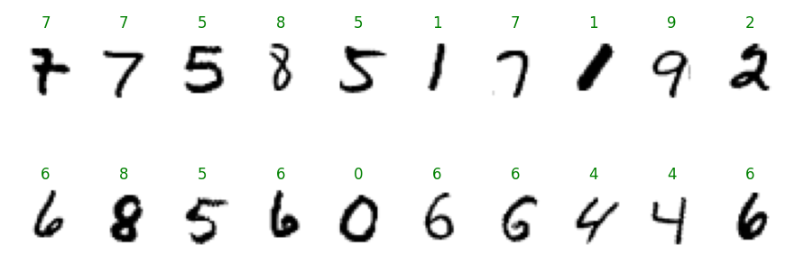

# MNIST 

An MNIST Digit Classifier as an introduction to the Pytorch framework

## Model Architecture

Currently using a small, basic Feed-forward Multilayer perceptron with 2 hidden layers and a ReLU activation function. Obviously a CNN would be better, may write one later... 

Consequently It can train on CPU without taking an eternity.

It achieved 98% accuracy after training for ~15 epochs.

## Project structure

* /src/
    * train.py : script to train models. models are saved to a /models/ directory
    * explore.py : used to visualize the dataset
    * test.py : test the model and visualize the results
* /models/
    * Where trained models are saved to by default
* /imgs/
    * makes the README cooler

### Running the test script

Green text indicates a correct classification, red text indicates a misclassification

## TODO

* Data Augmentation with transforms (better accuracy)
* Write a Convolutional Neural Network (also better accuracy)
* Learn argparse (seems to be pretty widley used)
